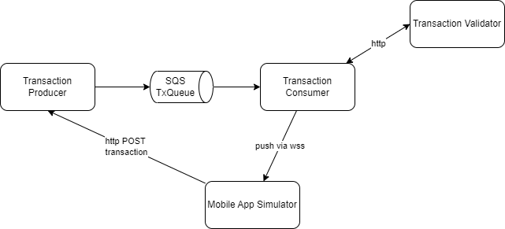
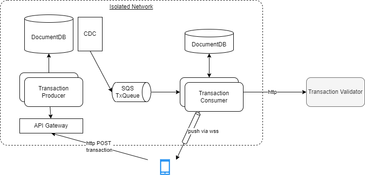

# A demonstration to get SQS messages using Quarkus app

Goal is to scale the asynchronous processing of transaction started from a mobile app.

## Requirements

* support mobile simulator as a chat interface. The submit button send a transaction
* Use AWS SQS queue for getting transaction messages.
* Use a producer of transaction which exposes a REST api to receive transaction from the mobile simulator
* Consume then contact a remote server to validate the transaction, then push the information to the connected mobile app.
* Push a validated message back to a web-socket app

## Components of this demo



Target architecture for a production ready solution:




### Physical deployment on AWS


## Run all the components locally with SQS localstack.

* Need to get aws CLI
* Need to get localstack cli using python virtual env and ` pip install localstack`
* use `aws configure` with key = test but region needs to be `us-east-1` as it is the default region for localstack
* Start docker compose with the different working components.

    ```sh
    docker-compose up -d
    ```

* Create the queue: QUEUE_URL=`aws sqs create-queue --queue-name=TxQueue --profile localstack --endpoint-url=http://localhost:4566`  or the script `create_queue.sh`
* Verify created queue with: 

    ```sh
    aws sqs list-queues --profile localstack --endpoint-url=http://localhost:4566
    ```
