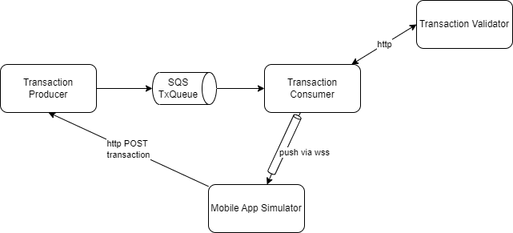

# A demonstration to get SQS message using Quarkus

## Requirements

* Get SQS queue for transactions
* Consume and contact a remote server to validate the transaction
* Push a validated message back to a web-socket app

## Components of this demo

## Run it locally

* Need to get aws CLI
* Need to get localstack cli using python virtual env and ` pip install localstack`
* use `aws configure` with key = test but region needs to be `us-east-1` as it is the default region for localstack
* Start docker compose with the different working components.
* Create the queue